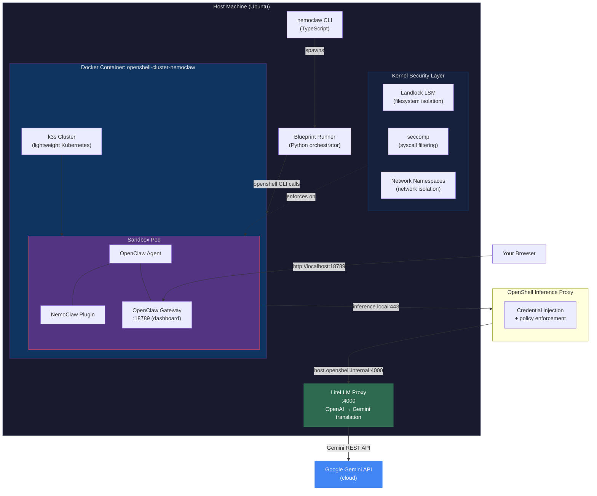
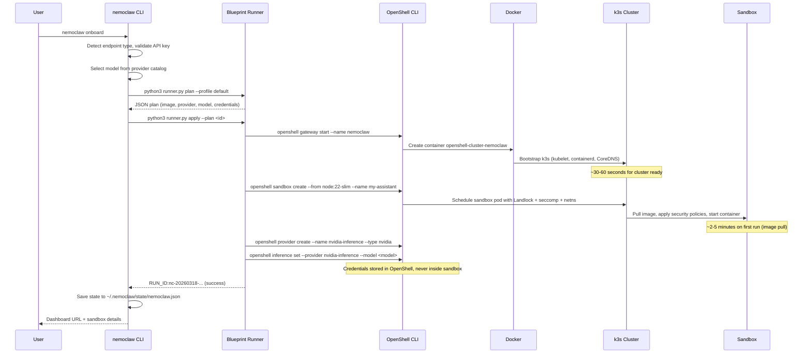
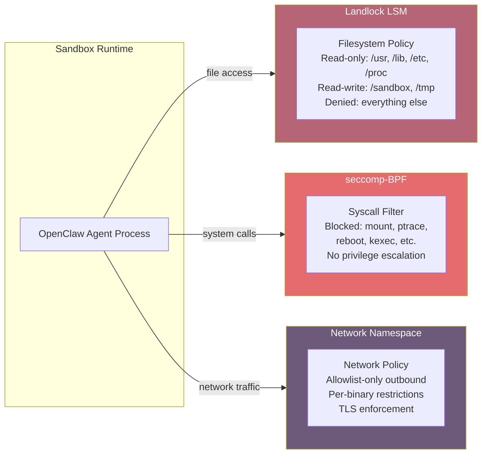
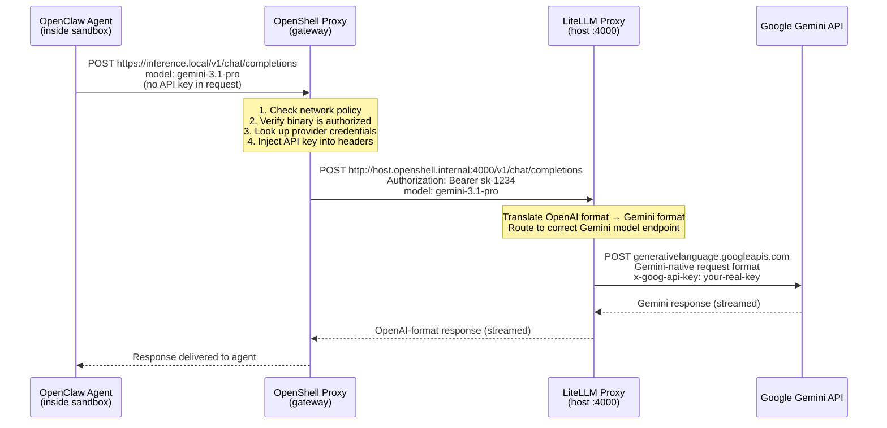

<!--
  SPDX-FileCopyrightText: Copyright (c) 2025-2026 NVIDIA CORPORATION & AFFILIATES. All rights reserved.
  SPDX-License-Identifier: Apache-2.0
-->

# NemoClaw with Google Gemini via LiteLLM — Complete Ubuntu Guide

This guide walks through the full journey: installing NemoClaw on Ubuntu, applying known fixes, and routing inference through Google Gemini models using a LiteLLM proxy.

## What is NemoClaw?

NemoClaw is an NVIDIA open source plugin for [OpenClaw](https://openclaw.ai) that creates **sandboxed AI agent environments**. Rather than letting an AI agent run loose on your machine with full access to your filesystem, network, and credentials, NemoClaw spins up an isolated environment where the agent operates under strict security constraints.

Under the hood, NemoClaw orchestrates a [k3s](https://k3s.io/) Kubernetes cluster inside a Docker container (managed by [OpenShell](https://github.com/NVIDIA/OpenShell)). Each sandbox is a Kubernetes pod with three layers of Linux kernel isolation:

- **Landlock LSM** — Filesystem access control (the agent can only read/write specific paths)
- **seccomp-BPF** — System call filtering (dangerous operations like `mount` and `ptrace` are blocked)
- **Network namespaces** — Allowlist-only network access (the agent can only reach approved endpoints)

The agent inside the sandbox talks to LLM providers through an inference proxy that injects credentials on the fly — the sandbox itself never holds your API keys.

## What is OpenShell?

[OpenShell](https://github.com/NVIDIA/OpenShell) is the infrastructure layer that makes all of this possible. It is an NVIDIA open source CLI tool that manages **sandboxed compute environments** for AI agents. Think of it as the runtime engine underneath NemoClaw.

OpenShell handles the heavy lifting that NemoClaw delegates to it:

- **Gateway management** — Starts and manages a [k3s](https://k3s.io/) (lightweight Kubernetes) cluster inside a Docker container. This is the `openshell gateway start` command, which creates the `openshell-cluster-nemoclaw` container you see in `docker ps`.
- **Sandbox lifecycle** — Creates, connects to, and destroys isolated sandbox pods inside the k3s cluster. Each sandbox is a Kubernetes pod with kernel-level isolation (Landlock, seccomp, network namespaces) applied at creation time.
- **Inference proxy** — Routes model API requests from inside the sandbox to external LLM providers. The proxy intercepts requests to `inference.local`, injects the correct API credentials, and forwards them to the configured provider. The sandbox process never sees the raw API key.
- **Provider registry** — Stores provider configurations (endpoint URLs, credential references, provider types) so you can switch inference backends without touching the sandbox.
- **Policy enforcement** — Applies and hot-reloads network policies that control which hosts and ports the sandbox can reach, down to per-binary and per-HTTP-method granularity.
- **Magic hostnames** — Provides `host.openshell.internal` (resolves from inside the sandbox to the host machine) and `inference.local` (resolves to the inference proxy), so sandboxed processes can reach host services without knowing the host's actual IP.

In short: **NemoClaw is the "what" (a sandboxed OpenClaw agent environment), and OpenShell is the "how" (the infrastructure that builds and enforces the sandbox).** You interact with NemoClaw's onboard wizard, and it calls `openshell` under the hood to create the gateway, sandbox, providers, and policies.

The key `openshell` commands used throughout this guide:

| Command | What it does |
|---|---|
| `openshell gateway start --name nemoclaw` | Launches the k3s cluster inside Docker |
| `openshell sandbox create --from <image>` | Creates an isolated sandbox pod in the cluster |
| `openshell sandbox connect <name>` | Opens an interactive shell inside the sandbox |
| `openshell provider create --name <n> --type <t>` | Registers an LLM provider (NVIDIA, OpenAI-compatible, etc.) |
| `openshell inference set --provider <p> --model <m>` | Sets which provider and model the proxy routes to |
| `openshell inference get` | Shows the current inference route |
| `openshell policy set` | Updates network policies at runtime (hot-reload) |
| `openshell status` | Reports gateway and sandbox health |
| `openshell gateway destroy -g nemoclaw` | Tears down the k3s cluster and Docker container |

## Why LiteLLM?

NemoClaw natively supports NVIDIA endpoints and OpenAI-compatible APIs. Google Gemini uses a different protocol, so we use [LiteLLM](https://github.com/BerriAI/litellm) as a translation layer — it exposes Gemini as an OpenAI-compatible `/v1/chat/completions` endpoint that NemoClaw can consume directly. This same approach works for any provider LiteLLM supports (Claude, Mistral, Cohere, and 100+ others).

### Why not run LiteLLM inside the OpenShell k3s cluster?

A natural question: if OpenShell already runs a k3s cluster, why not deploy LiteLLM as a service inside it? There are several reasons this does not work:

- **The cluster is not general-purpose.** OpenShell's k3s cluster is purpose-built for sandboxed agent pods. It does not expose raw `kubectl` or Helm — you interact through `openshell sandbox create`, which applies Landlock, seccomp, and network policies at creation time. There is no mechanism to deploy arbitrary services into the cluster.
- **Sandbox network policies would block it.** Sandboxes have allowlist-only outbound access. A LiteLLM process needs unrestricted outbound to reach Gemini, Claude, OpenAI, and any other provider — this directly violates the sandbox security model.
- **Credential isolation would break.** The core security design is that API keys live *outside* the sandbox, managed by OpenShell on the host. The inference proxy injects credentials at request time so the sandbox never sees them. Running LiteLLM inside the cluster would place your Gemini API key inside the security boundary, defeating this separation.
- **No Python runtime in the sandbox image.** The sandbox runs `node:22-slim` — there is no `pip` or Python package manager to install LiteLLM with.

LiteLLM runs on the **host**, outside the security boundary, where it can hold API keys and reach any provider. The OpenShell proxy bridges the gap by routing sandbox traffic to `host.openshell.internal:4000` — keeping the sandbox locked down while still reaching LiteLLM on the other side.

```
┌─────────────── Security Boundary ───────────────┐
│  k3s cluster (OpenShell-managed)                │
│  ┌──────────────────────────────┐               │
│  │ Sandbox (Landlock+seccomp)   │               │
│  │ No API keys, no pip, no      │               │
│  │ unrestricted network access  │───inference.local──► OpenShell Proxy
│  └──────────────────────────────┘               │         │
└─────────────────────────────────────────────────┘         │
                                                            ▼
                                                  ┌─── Host ───────┐
                                                  │ LiteLLM :4000  │
                                                  │ (holds API keys,│
                                                  │  reaches Gemini)│
                                                  └────────────────┘
```

**Duration:** 45–90 minutes | **Tested on:** Ubuntu 22.04–25.10, x86_64

---

## Part 1 — System Prerequisites

| Requirement | Minimum | Verify |
|---|---|---|
| Ubuntu | 22.04 LTS or later | `lsb_release -a` |
| Docker | Installed and running | `docker ps` |
| Node.js | 20+ (22 recommended) | `node --version` |
| npm | 10+ | `npm --version` |
| GitHub CLI | Latest | `gh --version` |
| Python | 3.9+ (for LiteLLM) | `python3 --version` |
| Google Gemini API key | From [aistudio.google.com](https://aistudio.google.com/apikey) | — |

---

## Part 2 — Install Docker and Node.js

### Docker

```bash
sudo apt-get update
sudo apt-get install -y ca-certificates curl
sudo install -m 0755 -d /etc/apt/keyrings
sudo curl -fsSL https://download.docker.com/linux/ubuntu/gpg -o /etc/apt/keyrings/docker.asc
sudo chmod a+r /etc/apt/keyrings/docker.asc

echo "deb [arch=$(dpkg --print-architecture) signed-by=/etc/apt/keyrings/docker.asc] \
  https://download.docker.com/linux/ubuntu $(. /etc/os-release && echo "$VERSION_CODENAME") stable" | \
  sudo tee /etc/apt/sources.list.d/docker.list > /dev/null

sudo apt-get update
sudo apt-get install -y docker-ce docker-ce-cli containerd.io docker-buildx-plugin docker-compose-plugin
```

Add your user to the docker group (log out and back in after):

```bash
sudo usermod -aG docker $USER
```

### Node.js 22

```bash
curl -fsSL https://deb.nodesource.com/setup_22.x | sudo -E bash -
sudo apt-get install -y nodejs
node --version   # v22.x.x
npm --version    # 10.x.x
```

### GitHub CLI

```bash
sudo apt-get install -y gh
gh auth login
```

---

## Part 3 — Fix inotify Limits (Critical)

The OpenShell gateway runs a k3s cluster inside Docker. The default Linux inotify limit (128 instances) is too low and causes the gateway to crash with "too many open files" or get stuck in "health: starting".

```bash
sudo sysctl fs.inotify.max_user_instances=512
sudo sysctl fs.inotify.max_user_watches=524288
```

Make permanent across reboots:

```bash
echo "fs.inotify.max_user_instances=512" | sudo tee -a /etc/sysctl.conf
echo "fs.inotify.max_user_watches=524288" | sudo tee -a /etc/sysctl.conf
```

Verify:

```bash
cat /proc/sys/fs/inotify/max_user_instances   # 512
cat /proc/sys/fs/inotify/max_user_watches     # 524288
```

> **Note:** This is the #1 cause of gateway failures on Ubuntu. If you skip this step and see "K8s namespace not ready", come back here.

---

## Part 4 — Install OpenShell CLI

```bash
gh auth setup-git

ARCH=$(uname -m)
case "$ARCH" in
  x86_64|amd64) ARCH="x86_64" ;;
  aarch64|arm64) ARCH="aarch64" ;;
esac
gh release download --repo NVIDIA/OpenShell \
  --pattern "openshell-${ARCH}-unknown-linux-musl.tar.gz"
tar xzf openshell-${ARCH}-unknown-linux-musl.tar.gz
sudo install -m 755 openshell /usr/local/bin/openshell
rm -f openshell openshell-${ARCH}-unknown-linux-musl.tar.gz
```

Verify:

```bash
openshell --version
```

---

## Part 5 — Install NemoClaw

```bash
git clone https://github.com/NVIDIA/NemoClaw
cd NemoClaw
sudo npm install -g .
```

Verify:

```bash
nemoclaw --help
```

> **Note:** OpenClaw is installed automatically inside the sandbox — you do not need to install it on the host.

---

## Part 6 — Known Fixes and Workarounds

Before running the onboard wizard, be aware of these issues that have been fixed in recent releases or may still affect your setup.

### Fix: `const` assignment error in policy handling

**Issue:** `nemoclaw onboard` crashes with `TypeError: Assignment to constant variable` during policy setup.

**Cause:** A `const` variable was used where a `let` was needed for the mutable `currentPolicy` variable.

**Fix:** Upgrade to the latest NemoClaw (commit `207622e` or later). If running from source:

```bash
cd NemoClaw && git pull && sudo npm install -g .
```

### Fix: PATH not updated after nvm installs Node.js

**Issue:** If nvm is used to install Node.js, the `node` and `npm` commands may not be on PATH in the current shell session, causing onboard to fail.

**Fix:** Resolved in commit `90c832d`. If you encounter this, source your profile:

```bash
source ~/.bashrc   # or ~/.zshrc
```

### Fix: GPU sandbox creation failures on DGX

**Issue:** On DGX machines, sandbox creation fails because the GPU runtime is not properly configured.

**Fix:** Resolved in commit `71f01b3`. Ensure you have the latest NemoClaw.

### Fix: Sandbox name quoting in shell commands

**Issue:** Sandbox names containing special characters could cause command injection or failures.

**Fix:** Resolved in commits `b9f428d` and `4013dca`. Always use simple alphanumeric sandbox names as a best practice.

### Stale gateway state

If a previous run left a broken gateway:

```bash
openshell gateway destroy -g nemoclaw
docker rm -f openshell-cluster-nemoclaw
docker volume prune -f
```

---

## Part 7 — Run the Onboard Wizard (NVIDIA Cloud)

For the initial setup, onboard with the default NVIDIA cloud inference. We will switch to Gemini afterward.

```bash
export NVIDIA_API_KEY=nvapi-YOUR_KEY_HERE
nemoclaw onboard
```

The wizard walks through seven steps:

| Step | What happens |
|---|---|
| 1. API Key | Uses your NVIDIA key (auto-detected from env) |
| 2. Preflight | Checks Docker, OpenShell, inotify |
| 3. Gateway | Starts the k3s cluster (~30–60 sec) |
| 4. Sandbox | Creates the isolated environment (~2–5 min first run) |
| 5. Inference | Configures NVIDIA cloud routing |
| 6. OpenClaw | Configured on first connect |
| 7. Policies | Accept preset network policies |

Expected output:

```
──────────────────────────────────────────────────
Dashboard    http://localhost:18789/
Sandbox      my-assistant (Landlock + seccomp + netns)
Model        nvidia/nemotron-3-super-120b-a12b (NVIDIA Cloud API)
──────────────────────────────────────────────────
```

> **Tip:** If you don't have an NVIDIA API key, you can still proceed — the next section replaces the inference backend with Gemini.

---

## Part 8 — Set Up LiteLLM Proxy for Gemini

### Why LiteLLM?

NemoClaw's OpenShell proxy speaks the OpenAI API protocol (`/v1/chat/completions`). Google Gemini uses a different API format. LiteLLM acts as a translation layer:

```
Sandbox (OpenClaw) → OpenShell proxy → LiteLLM (:4000) → Gemini API
```

### Install LiteLLM

```bash
pip install 'litellm[proxy]'
```

Or in a virtual environment:

```bash
python3 -m venv ~/litellm-env
source ~/litellm-env/bin/activate
pip install 'litellm[proxy]'
```

### Configure the Proxy

Create a config file. The example below includes Gemini (the focus of this guide) plus several other popular providers — comment out or remove any you do not need:

```bash
mkdir -p ~/.litellm
cat > ~/.litellm/config.yaml << 'EOF'
model_list:
  # ── Google Gemini ──────────────────────────────────────────
  - model_name: gemini-3.1-pro
    litellm_params:
      model: gemini/gemini-3.1-pro-preview
      api_key: os.environ/GEMINI_API_KEY

  - model_name: gemini-3-flash
    litellm_params:
      model: gemini/gemini-3.0-flash
      api_key: os.environ/GEMINI_API_KEY

  - model_name: gemini-3.1-flash-lite
    litellm_params:
      model: gemini/gemini-3.1-flash-lite-preview
      api_key: os.environ/GEMINI_API_KEY

  # ── Ollama (local, no API key needed) ──────────────────────
  # Make sure Ollama is running: ollama serve
  # Pull models first: ollama pull qwen3
  - model_name: qwen3
    litellm_params:
      model: ollama/qwen3
      api_base: http://localhost:11434

  - model_name: llama3.1
    litellm_params:
      model: ollama/llama3.1
      api_base: http://localhost:11434

  # ── Anthropic Claude (direct API) ─────────────────────────
  - model_name: claude-sonnet
    litellm_params:
      model: claude-sonnet-4-6-20260217
      api_key: os.environ/ANTHROPIC_API_KEY
      max_tokens: 16384

  - model_name: claude-haiku
    litellm_params:
      model: claude-haiku-4-5-20251001
      api_key: os.environ/ANTHROPIC_API_KEY
      max_tokens: 8192

  # ── Azure AI Foundry ──────────────────────────────────────
  # model name after azure/ must match your deployment name
  - model_name: azure-gpt-5
    litellm_params:
      model: azure/gpt-5
      api_key: os.environ/AZURE_API_KEY
      api_base: os.environ/AZURE_API_BASE
      api_version: os.environ/AZURE_API_VERSION

  # ── AWS Bedrock (Claude on AWS) ───────────────────────────
  - model_name: bedrock-claude-sonnet
    litellm_params:
      model: bedrock/anthropic.claude-sonnet-4-6-v1
      aws_access_key_id: os.environ/AWS_ACCESS_KEY_ID
      aws_secret_access_key: os.environ/AWS_SECRET_ACCESS_KEY
      aws_region_name: os.environ/AWS_REGION_NAME

  # ── Cloudflare Workers AI ─────────────────────────────────
  - model_name: cf-qwen3
    litellm_params:
      model: cloudflare/@cf/qwen/qwen3-30b-a3b-fp8
      api_key: os.environ/CLOUDFLARE_API_KEY
      account_id: os.environ/CLOUDFLARE_ACCOUNT_ID
EOF
```

Set the environment variables for the providers you plan to use:

```bash
# Required for this guide
export GEMINI_API_KEY=your-gemini-api-key

# Optional — only set the ones you need
export ANTHROPIC_API_KEY=sk-ant-your-key
export AZURE_API_KEY=your-azure-key
export AZURE_API_BASE=https://your-resource.openai.azure.com
export AZURE_API_VERSION=2024-12-01-preview
export AWS_ACCESS_KEY_ID=AKIA...
export AWS_SECRET_ACCESS_KEY=your-secret
export AWS_REGION_NAME=us-east-1
export CLOUDFLARE_API_KEY=your-cf-token
export CLOUDFLARE_ACCOUNT_ID=your-account-id
```

> **Note:** LiteLLM only calls a provider when a request uses that provider's `model_name`. Unused providers with missing env vars will not cause startup errors — they only fail if you actually route a request to them. See Part 12 for detailed per-provider configuration and notes.

### Start the Proxy

```bash
export GEMINI_API_KEY=your-gemini-api-key-here
litellm --config ~/.litellm/config.yaml --port 4000 --host 0.0.0.0
```

Verify the proxy is running:

```bash
curl http://localhost:4000/v1/models
```

You should see your Gemini models listed in OpenAI format.

Test a completion:

```bash
curl http://localhost:4000/v1/chat/completions \
  -H "Content-Type: application/json" \
  -H "Authorization: Bearer sk-1234" \
  -d '{
    "model": "gemini-3.1-pro",
    "messages": [{"role": "user", "content": "Hello!"}]
  }'
```

> **Note:** LiteLLM accepts any Bearer token by default. For production use, configure authentication in the LiteLLM config.

### Run LiteLLM in the Background (Optional)

For a more persistent setup:

```bash
nohup litellm --config ~/.litellm/config.yaml --port 4000 --host 0.0.0.0 \
  > /tmp/litellm.log 2>&1 &
echo $!  # Save the PID if you need to stop it later
```

---

## Part 9 — Point NemoClaw at the LiteLLM Proxy

### Step 1: Create an OpenShell Provider

Register the LiteLLM proxy as an OpenAI-compatible provider:

```bash
openshell provider create \
  --name litellm-gemini \
  --type openai \
  --credential "OPENAI_API_KEY=sk-1234" \
  --config "OPENAI_BASE_URL=http://host.openshell.internal:4000/v1"
```

> **Key detail:** Use `host.openshell.internal` (not `localhost`) — this is the magic hostname that resolves from inside the sandbox to the host machine.

### Step 2: Set the Inference Route

```bash
openshell inference set \
  --provider litellm-gemini \
  --model gemini-3.1-pro
```

Verify:

```bash
openshell inference get
```

### Step 3: Update OpenClaw Config Inside the Sandbox

The sandbox's OpenClaw config still references the default NVIDIA model. Update it to match:

```bash
openshell sandbox connect my-assistant
```

Inside the sandbox:

```bash
node -e "
const fs = require('fs');
const path = '/sandbox/.openclaw/openclaw.json';
const config = JSON.parse(fs.readFileSync(path, 'utf8'));
config.models.providers.nvidia.models[0].id = 'gemini-3.1-pro';
config.models.providers.nvidia.models[0].name = 'Gemini 3.1 Pro';
config.agents.defaults.model.primary = 'nvidia/gemini-3.1-pro';
config.agents.defaults.models = {'nvidia/gemini-3.1-pro': {}};
fs.writeFileSync(path, JSON.stringify(config, null, 2));
console.log('done');
"
```

Exit the sandbox:

```bash
exit
```

> **Note:** The sandbox is a minimal `node:22-slim` image — `vi`, `nano`, and `python3` are not available. Use `node -e` for JSON edits.

---

## Part 10 — Test Gemini Through the Sandbox

### Web UI

```bash
openshell sandbox connect my-assistant
```

Inside the sandbox:

```bash
export NVIDIA_API_KEY=sk-1234
export ANTHROPIC_API_KEY=sk-1234

nemoclaw-start

mkdir -p /sandbox/.openclaw/workspace/memory
echo "# Memory" > /sandbox/.openclaw/workspace/MEMORY.md

openclaw config set gateway.controlUi.dangerouslyAllowHostHeaderOriginFallback true

nohup openclaw gateway run \
  --allow-unconfigured --dev \
  --bind loopback --port 18789 \
  > /tmp/gateway.log 2>&1 &

openclaw dashboard
```

Copy the dashboard URL and open it in your browser:

```
http://127.0.0.1:18789/#token=YOUR_UNIQUE_TOKEN
```

Click **Chat** and send a test message. The response should come from Gemini.

### Command-Line Agent

```bash
openshell sandbox connect my-assistant
export NVIDIA_API_KEY=sk-1234
export ANTHROPIC_API_KEY=sk-1234
openclaw agent --agent main --local -m "What model are you?" --session-id s1
```

The agent should identify itself as Gemini.

---

## Part 11 — Switching Between Models

One advantage of the LiteLLM proxy is easy model switching. Change the inference route without restarting anything:

```bash
# Switch to Gemini 3 Flash
openshell inference set --provider litellm-gemini --model gemini-3-flash

# Switch to Gemini 3.1 Flash-Lite (cheapest)
openshell inference set --provider litellm-gemini --model gemini-3.1-flash-lite
```

Remember to update the OpenClaw config inside the sandbox each time you switch models (see Part 9, Step 3).

---

## Part 12 — Adding More Providers to LiteLLM

LiteLLM supports 100+ LLM providers. Below are complete, copy-paste-ready configurations for six popular backends. You can combine any of these into a single `~/.litellm/config.yaml` — LiteLLM routes each request to the correct provider based on the `model_name` you specify.

### Google Gemini (Direct API)

The configuration used throughout this guide. Requires a Gemini API key from [aistudio.google.com](https://aistudio.google.com/apikey).

```bash
export GEMINI_API_KEY=your-gemini-api-key
```

```yaml
model_list:
  - model_name: gemini-3.1-pro
    litellm_params:
      model: gemini/gemini-3.1-pro-preview
      api_key: os.environ/GEMINI_API_KEY

  - model_name: gemini-3-flash
    litellm_params:
      model: gemini/gemini-3.0-flash
      api_key: os.environ/GEMINI_API_KEY

  - model_name: gemini-3.1-flash-lite
    litellm_params:
      model: gemini/gemini-3.1-flash-lite-preview
      api_key: os.environ/GEMINI_API_KEY
```

### Ollama (Local Models)

Run models locally with [Ollama](https://ollama.com). No API key needed. Make sure Ollama is running (`ollama serve`) and you have pulled the model (`ollama pull qwen3`).

```yaml
model_list:
  - model_name: qwen3
    litellm_params:
      model: ollama/qwen3
      api_base: http://localhost:11434

  - model_name: llama3.1
    litellm_params:
      model: ollama/llama3.1
      api_base: http://localhost:11434

  - model_name: qwen2.5-coder
    litellm_params:
      model: ollama/qwen2.5-coder
      api_base: http://localhost:11434

  - model_name: nemotron-mini
    litellm_params:
      model: ollama/nemotron-mini
      api_base: http://localhost:11434
```

> **Note:** Ollama runs on the host, so the LiteLLM proxy reaches it at `localhost:11434`. Streaming with Ollama through the OpenShell proxy can produce errors on long responses — see the Troubleshooting section if you encounter "error decoding response body."

### Anthropic Claude (Direct API)

Requires an API key from [console.anthropic.com](https://console.anthropic.com/).

```bash
export ANTHROPIC_API_KEY=sk-ant-your-key
```

```yaml
model_list:
  - model_name: claude-opus
    litellm_params:
      model: claude-opus-4-6-20260204
      api_key: os.environ/ANTHROPIC_API_KEY
      max_tokens: 16384

  - model_name: claude-sonnet
    litellm_params:
      model: claude-sonnet-4-6-20260217
      api_key: os.environ/ANTHROPIC_API_KEY
      max_tokens: 16384

  - model_name: claude-haiku
    litellm_params:
      model: claude-haiku-4-5-20251001
      api_key: os.environ/ANTHROPIC_API_KEY
      max_tokens: 8192
```

### Azure AI Foundry (Azure-hosted Models)

Azure AI Foundry provides managed endpoints for OpenAI, Meta, Mistral, and other models. You need your deployment endpoint URL and API key from the [Azure AI Foundry portal](https://ai.azure.com/).

```bash
export AZURE_API_KEY=your-azure-api-key
export AZURE_API_BASE=https://your-resource.openai.azure.com
export AZURE_API_VERSION=2025-04-01-preview
```

```yaml
model_list:
  - model_name: azure-gpt-5
    litellm_params:
      model: azure/gpt-5
      api_key: os.environ/AZURE_API_KEY
      api_base: os.environ/AZURE_API_BASE
      api_version: os.environ/AZURE_API_VERSION

  - model_name: azure-gpt-5-mini
    litellm_params:
      model: azure/gpt-5-mini
      api_key: os.environ/AZURE_API_KEY
      api_base: os.environ/AZURE_API_BASE
      api_version: os.environ/AZURE_API_VERSION

  - model_name: azure-gpt-4.1
    litellm_params:
      model: azure/gpt-4.1
      api_key: os.environ/AZURE_API_KEY
      api_base: os.environ/AZURE_API_BASE
      api_version: os.environ/AZURE_API_VERSION
```

> **Note:** Azure uses deployment names, not raw model IDs. The `model` field after `azure/` must match your deployment name in Azure AI Foundry. GPT-5 requires registration for access; GPT-4.1 retires October 2026.

### AWS Bedrock (Anthropic Claude on AWS)

Access Claude and other models through AWS Bedrock. Requires AWS credentials configured via environment variables or `~/.aws/credentials`. No API key field needed — LiteLLM uses the AWS SDK credential chain.

```bash
export AWS_ACCESS_KEY_ID=AKIA...
export AWS_SECRET_ACCESS_KEY=your-secret-key
export AWS_REGION_NAME=us-east-1
```

```yaml
model_list:
  - model_name: bedrock-claude-opus
    litellm_params:
      model: bedrock/anthropic.claude-opus-4-6-v1
      aws_access_key_id: os.environ/AWS_ACCESS_KEY_ID
      aws_secret_access_key: os.environ/AWS_SECRET_ACCESS_KEY
      aws_region_name: os.environ/AWS_REGION_NAME

  - model_name: bedrock-claude-sonnet
    litellm_params:
      model: bedrock/anthropic.claude-sonnet-4-6-v1
      aws_access_key_id: os.environ/AWS_ACCESS_KEY_ID
      aws_secret_access_key: os.environ/AWS_SECRET_ACCESS_KEY
      aws_region_name: os.environ/AWS_REGION_NAME

  - model_name: bedrock-claude-haiku
    litellm_params:
      model: bedrock/anthropic.claude-haiku-4-5-20251001-v1:0
      aws_access_key_id: os.environ/AWS_ACCESS_KEY_ID
      aws_secret_access_key: os.environ/AWS_SECRET_ACCESS_KEY
      aws_region_name: os.environ/AWS_REGION_NAME
```

> **Note:** Claude Opus 4.6 and Sonnet 4.6 are the latest models on Bedrock (launched Feb 2026). You must enable model access in the AWS console before using them. Check the [AWS Bedrock model IDs page](https://docs.aws.amazon.com/bedrock/latest/userguide/model-ids.html) for exact identifiers.

### Cloudflare Workers AI

Run models on Cloudflare's global edge network. Requires your Cloudflare account ID and an API token from the [Cloudflare dashboard](https://dash.cloudflare.com/).

```bash
export CLOUDFLARE_API_KEY=your-cf-api-token
export CLOUDFLARE_ACCOUNT_ID=your-account-id
```

```yaml
model_list:
  - model_name: cf-qwen3
    litellm_params:
      model: cloudflare/@cf/qwen/qwen3-30b-a3b-fp8
      api_key: os.environ/CLOUDFLARE_API_KEY
      account_id: os.environ/CLOUDFLARE_ACCOUNT_ID

  - model_name: cf-nemotron
    litellm_params:
      model: cloudflare/@cf/nvidia/nemotron-3-120b-a12b
      api_key: os.environ/CLOUDFLARE_API_KEY
      account_id: os.environ/CLOUDFLARE_ACCOUNT_ID

  - model_name: cf-llama3.1
    litellm_params:
      model: cloudflare/@cf/meta/llama-3.1-8b-instruct
      api_key: os.environ/CLOUDFLARE_API_KEY
      account_id: os.environ/CLOUDFLARE_ACCOUNT_ID
```

> **Note:** Cloudflare Workers AI model names use the `@cf/` prefix. Recent additions include NVIDIA Nemotron 3 Super (March 2026) and Qwen3. Check the [Cloudflare Workers AI models page](https://developers.cloudflare.com/workers-ai/models/) for the full catalog.

### Combining Multiple Providers

You can put all providers into a single `~/.litellm/config.yaml`. LiteLLM routes based on `model_name`:

```bash
cat > ~/.litellm/config.yaml << 'EOF'
model_list:
  # Google Gemini
  - model_name: gemini-3.1-pro
    litellm_params:
      model: gemini/gemini-3.1-pro-preview
      api_key: os.environ/GEMINI_API_KEY

  # Local Ollama
  - model_name: qwen3
    litellm_params:
      model: ollama/qwen3
      api_base: http://localhost:11434

  # Anthropic Claude
  - model_name: claude-sonnet
    litellm_params:
      model: claude-sonnet-4-6-20260217
      api_key: os.environ/ANTHROPIC_API_KEY
      max_tokens: 16384

  # Azure AI Foundry
  - model_name: azure-gpt-5
    litellm_params:
      model: azure/gpt-5
      api_key: os.environ/AZURE_API_KEY
      api_base: os.environ/AZURE_API_BASE
      api_version: os.environ/AZURE_API_VERSION

  # AWS Bedrock
  - model_name: bedrock-claude-sonnet
    litellm_params:
      model: bedrock/anthropic.claude-sonnet-4-6-v1
      aws_access_key_id: os.environ/AWS_ACCESS_KEY_ID
      aws_secret_access_key: os.environ/AWS_SECRET_ACCESS_KEY
      aws_region_name: os.environ/AWS_REGION_NAME

  # Cloudflare Workers AI
  - model_name: cf-qwen3
    litellm_params:
      model: cloudflare/@cf/qwen/qwen3-30b-a3b-fp8
      api_key: os.environ/CLOUDFLARE_API_KEY
      account_id: os.environ/CLOUDFLARE_ACCOUNT_ID
EOF
```

Restart the proxy after editing the config:

```bash
litellm --config ~/.litellm/config.yaml --port 4000 --host 0.0.0.0
```

Then switch the inference route to any model by name:

```bash
# Switch to local Ollama (Qwen3)
openshell inference set --provider litellm-gemini --model qwen3

# Switch to Claude Sonnet 4.6 on Anthropic
openshell inference set --provider litellm-gemini --model claude-sonnet

# Switch to Claude Sonnet 4.6 on AWS Bedrock
openshell inference set --provider litellm-gemini --model bedrock-claude-sonnet

# Switch to GPT-5 on Azure
openshell inference set --provider litellm-gemini --model azure-gpt-5

# Switch to Qwen3 on Cloudflare edge
openshell inference set --provider litellm-gemini --model cf-qwen3
```

> **Reminder:** After switching models, update the OpenClaw config inside the sandbox to match (see Part 9, Step 3). The `model_name` you pass to `openshell inference set` must exactly match a `model_name` in your LiteLLM config.

---

## How NemoClaw Works Under the Hood

Before diving into troubleshooting, it helps to understand what NemoClaw actually built on your machine. This section explains the internals — useful if you want to debug issues, extend the setup, or just understand what is running.

### The Three-Layer Architecture

NemoClaw is not a single binary. It is an orchestration system built from three cooperating layers:

1. **Plugin Layer (TypeScript CLI)** — The `nemoclaw` command you run on the host. It drives the onboard wizard, resolves blueprints, and delegates infrastructure work to the layers below.

2. **Blueprint Runner (Python orchestrator)** — A Python script (`orchestrator/runner.py`) that translates high-level intents ("create a sandbox with NVIDIA inference") into concrete `openshell` CLI calls. It manages the plan/apply lifecycle and tracks run state.

3. **OpenShell Gateway (k3s inside Docker)** — The actual infrastructure. OpenShell starts a lightweight [k3s](https://k3s.io/) Kubernetes cluster inside a Docker container (`openshell-cluster-nemoclaw`). Sandboxes are pods running inside this cluster, isolated by Linux kernel security primitives.

### Architecture Diagram (with LiteLLM)



### What Happens When You Run `nemoclaw onboard`

The onboard wizard is not just a configuration prompt — it bootstraps an entire isolated compute environment. Here is the sequence:



### The k3s Cluster: Kubernetes in a Box

When OpenShell starts the gateway, it launches a full (but lightweight) Kubernetes distribution called [k3s](https://k3s.io/) inside a single Docker container. This is the core infrastructure that makes sandboxing possible:

- **Container name:** `openshell-cluster-nemoclaw`
- **Inside the container:** kubelet, containerd, CoreDNS, kube-proxy — a complete single-node Kubernetes cluster
- **Sandboxes are pods:** Each sandbox (like `my-assistant`) is a Kubernetes pod scheduled by k3s, not a raw Docker container
- **Why k3s?** It provides network policies, resource limits, and namespace isolation that plain Docker does not offer. NemoClaw delegates all of this to OpenShell rather than managing Kubernetes directly.

You can inspect the cluster yourself:

```bash
# See the gateway container
docker ps --filter name=openshell-cluster

# Check gateway health
openshell status

# View sandbox pod status (from inside the gateway)
docker exec openshell-cluster-nemoclaw k3s kubectl get pods -n openshell
```

> **Why inotify matters:** k3s watches many files inside the container (kubelet configs, pod manifests, containerd sockets). The default Linux limit of 128 inotify instances is exhausted almost immediately, causing k3s to crash with "too many open files." This is why Part 3 is marked critical.

### Sandbox Security: Three Layers of Isolation

NemoClaw sandboxes are not just containers — they enforce isolation at the Linux kernel level using three complementary mechanisms:



**Landlock** (Linux Security Module) — Controls which filesystem paths the sandbox can access. The policy is defined in `openclaw-sandbox.yaml`:

| Access | Paths |
|---|---|
| Read-only | `/usr`, `/lib`, `/proc`, `/dev/urandom`, `/app`, `/etc`, `/var/log` |
| Read-write | `/sandbox`, `/tmp`, `/dev/null` |
| Denied | Everything else (including host filesystem) |

**seccomp-BPF** (Secure Computing Mode) — Filters system calls at the kernel level. Dangerous syscalls like `mount`, `ptrace`, `reboot`, and privilege escalation paths are blocked. The sandbox process runs as a non-root user (`sandbox:sandbox`).

**Network Namespaces + Policies** — The sandbox has its own network stack. Outbound traffic is denied by default and only allowed to specific hosts on specific ports, with per-binary restrictions. For example:

| Policy | Allowed hosts | Restricted to binaries |
|---|---|---|
| `nvidia` | `integrate.api.nvidia.com:443` | `openclaw`, `claude` |
| `github` | `github.com:443`, `api.github.com:443` | `gh`, `git` |
| `npm_registry` | `registry.npmjs.org:443` | `openclaw`, `npm` |
| `telegram` | `api.telegram.org:443` | Any (GET/POST to `/bot*/**` only) |

Network policies are hot-reloadable — you can add or remove allowed endpoints at runtime using `openshell policy set` without restarting the sandbox.

### Inference Routing: How Your Prompt Reaches Gemini

The inference path is the most interesting part of the architecture. The agent inside the sandbox never talks directly to any LLM provider. Instead, every model request is intercepted, validated, and proxied:



Key design decisions in this flow:

- **The sandbox never holds API keys.** Credentials are stored in the OpenShell provider configuration on the host. The proxy injects them at request time.
- **`inference.local`** is a magic hostname that resolves to the OpenShell proxy from inside the sandbox. The agent treats it like any OpenAI-compatible endpoint.
- **`host.openshell.internal`** is another magic hostname that resolves from inside the gateway's network to the host machine. This is how the proxy reaches LiteLLM running on the host.
- **Two translation layers:** OpenShell translates the sandbox's request into a provider-specific format, then LiteLLM translates the OpenAI format into Gemini's native format.

### The Two-Layer Model Configuration Problem

One of the most common gotchas is that model configuration exists in **two separate places**, and they must agree:

| Layer | Config location | Controls | Set by |
|---|---|---|---|
| OpenShell inference route | `openshell inference get` | Which provider and model the proxy routes to | `openshell inference set` |
| OpenClaw model in sandbox | `/sandbox/.openclaw/openclaw.json` | Which model ID the agent puts in its API requests | Dockerfile (baked at build time) |

When you switch models (e.g., from NVIDIA to Gemini), you must update **both** layers. If you only update the inference route but not the OpenClaw config, the agent sends `model: nvidia/nemotron-3-super-120b-a12b` in its requests, and LiteLLM responds with "model not found" because it only knows about `gemini-3.1-pro`.

This is why Part 9, Step 3 exists — it patches the OpenClaw config inside the sandbox to match the new model.

### State and Configuration Files

NemoClaw tracks its state across several files on the host:

| File | Purpose |
|---|---|
| `~/.nemoclaw/state/nemoclaw.json` | Last action, run ID, blueprint version, sandbox name |
| `~/.nemoclaw/config.json` | Onboarding config: endpoint type, URL, model, credential env var |
| `~/.nemoclaw/blueprints/<version>/` | Cached blueprint artifacts (orchestrator, policies, manifest) |
| `~/.nemoclaw/state/runs/<run-id>/plan.json` | Execution plan for each apply (provider config, sandbox image, model) |

Inside the sandbox:

| File | Purpose |
|---|---|
| `/sandbox/.openclaw/openclaw.json` | OpenClaw's model config, gateway settings, allowed origins |
| `/sandbox/.openclaw/agents/main/agent/auth-profiles.json` | API key references (points to env vars, not raw keys) |
| `/sandbox/.nemoclaw/blueprints/0.1.0/` | Blueprint copy for in-sandbox operations |

### What `nemoclaw-start` Does Inside the Sandbox

When the sandbox boots, the entrypoint script (`nemoclaw-start.sh`) runs a setup sequence:

1. **Fix OpenClaw config** — Sets the default model, configures the gateway for local mode, writes allowed CORS origins for the dashboard
2. **Write auth profile** — If `NVIDIA_API_KEY` is set, creates an auth profile so OpenClaw knows how to reference the credential
3. **Install NemoClaw plugin** — Registers the NemoClaw plugin with OpenClaw (`openclaw plugins install /opt/nemoclaw`)
4. **Start OpenClaw gateway** — Launches the dashboard and API server on port 18789
5. **Launch auto-pair watcher** — A background Python process that automatically approves device pairing requests for 10 minutes, so the browser dashboard connects without manual approval

---

## Troubleshooting

| Issue | Cause | Solution |
|---|---|---|
| LiteLLM: "Connection refused" on :4000 | Proxy not running | Start `litellm --config ~/.litellm/config.yaml --port 4000` |
| "Model not found" in sandbox | OpenClaw config not updated | Update `/sandbox/.openclaw/openclaw.json` (see Part 9, Step 3) |
| "Could not resolve host.openshell.internal" | Provider URL wrong | Use `host.openshell.internal`, not `localhost` |
| Streaming errors / partial responses | LiteLLM-Gemini compat issue | Try adding `stream: false` or update LiteLLM: `pip install -U litellm` |
| 401 Unauthorized from Gemini | Bad API key | Verify `GEMINI_API_KEY` is set correctly; test with `curl` directly |
| LiteLLM returns 500 | Model name mismatch | Check `litellm --config` output; model names must match exactly |
| "K8s namespace not ready" | inotify limits | `sudo sysctl fs.inotify.max_user_instances=512` |
| Gateway stuck in "health: starting" | inotify / containerd | Fix inotify, destroy gateway, restart |
| Dashboard 401 | Wrong URL format | Use `#token=...` not `?token=...` |

---

## Useful Commands

| Command | Purpose |
|---|---|
| `litellm --config ~/.litellm/config.yaml --port 4000` | Start LiteLLM proxy |
| `curl http://localhost:4000/v1/models` | List models on LiteLLM |
| `openshell provider create --name ... --type openai` | Register LiteLLM as a provider |
| `openshell inference set --provider ... --model ...` | Switch inference model |
| `openshell inference get` | Check current inference route |
| `openshell sandbox connect my-assistant` | Shell into sandbox |
| `openshell status` | Check gateway health |
| `openshell term` | Open monitoring TUI |

---

## Cleanup

```bash
# Stop LiteLLM
kill $(pgrep -f "litellm")

# Remove sandbox and gateway
openshell sandbox delete my-assistant
openshell gateway destroy -g nemoclaw

# Uninstall NemoClaw
sudo npm uninstall -g nemoclaw
rm -rf ~/.nemoclaw

# Remove LiteLLM
pip uninstall litellm -y
rm -rf ~/.litellm
```

---

## Summary

### What You Built

By completing this guide, you have assembled the following stack:

| Layer | What | Where | Role |
|---|---|---|---|
| NemoClaw CLI | TypeScript plugin for OpenClaw | Host (global npm) | Orchestrates the entire setup via the onboard wizard |
| Blueprint Runner | Python orchestrator | `~/.nemoclaw/blueprints/` | Translates high-level intents into `openshell` CLI calls |
| OpenShell Gateway | k3s cluster in Docker | `openshell-cluster-nemoclaw` container | Provides Kubernetes infrastructure for sandbox pods |
| Sandbox | Isolated Kubernetes pod | Inside k3s cluster | Runs OpenClaw agent with Landlock + seccomp + netns |
| OpenShell Proxy | Inference routing + credential injection | Gateway network | Intercepts model requests, injects API keys, enforces policies |
| LiteLLM Proxy | OpenAI → Gemini protocol translation | Host `:4000` | Makes Gemini look like an OpenAI-compatible endpoint |

### The Full Request Path

```
Your browser → OpenClaw dashboard (:18789) → Agent → inference.local
  → OpenShell proxy (credential injection) → host.openshell.internal:4000
  → LiteLLM (protocol translation) → Google Gemini API (cloud)
```

### Key Takeaways

- **Sandboxes are Kubernetes pods**, not raw Docker containers. This gives you network policies, resource limits, and namespace isolation for free.
- **The agent never holds API keys.** Credentials live in the OpenShell provider config on the host and are injected by the proxy at request time.
- **Model config lives in two places** — the OpenShell inference route and the OpenClaw config inside the sandbox. Both must agree.
- **Network access is allowlist-only.** The sandbox can only reach endpoints explicitly permitted in the policy file — no arbitrary internet access.
- **LiteLLM is the universal adapter.** This approach works for **any** LLM provider that LiteLLM supports — not just Gemini. You can route NemoClaw through Claude, GPT-4, Mistral, Cohere, or any other provider by adding it to the LiteLLM config.

---

## Safety & Risks

- **API key exposure:** Your Gemini API key is stored in the LiteLLM process environment. Do not expose port 4000 to the public internet.
- **Data leakage:** The agent can expose materials it accesses to the inference provider.
- **Cost:** Gemini API calls are billed to your Google Cloud account. Monitor usage.
- **Sandbox isolation:** NemoClaw sandboxes enforce network policies, but the LiteLLM proxy runs on the host outside the sandbox.

Use only clean environments with no sensitive data or credentials.
